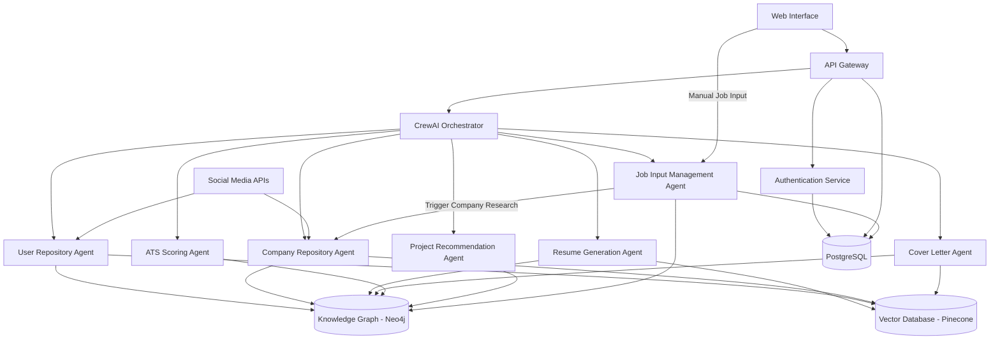
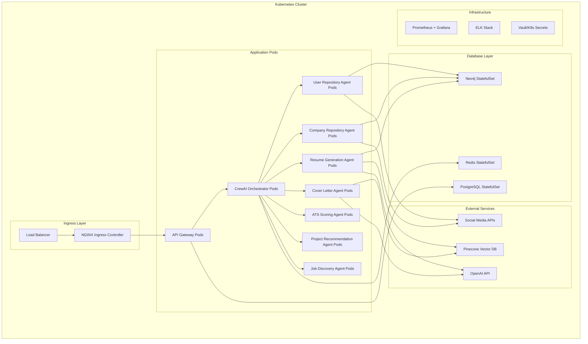

# Design Document

## Overview

The AI Job Application Assistant is a repository-based system powered by CrewAI agents that optimizes job applications through AI-enhanced manual processes. Users manually input job details (including company website and application URL) while the platform automatically researches companies and generates tailored application materials. The system maintains separate user and company repositories organized as knowledge graphs, enabling CrewAI agents to understand complex relationships between skills, experiences, job requirements, and company contexts. Users maintain full control over the application process, reviewing and downloading generated materials for manual submission. The system uses a hybrid database approach combining knowledge graphs, vector databases, and relational storage for optimal performance.

## Architecture

### High-Level Architecture



### CrewAI Agent Architecture

The system is built around specialized CrewAI agents that collaborate to complete complex workflows:

- **User Repository Agent**: Manages user data collection, parsing, and knowledge graph updates
- **Company Repository Agent**: Handles automated company research based on user-provided company names and websites
- **Resume Generation Agent**: Creates tailored resumes using knowledge graph relationships
- **Cover Letter Agent**: Generates personalized cover letters with company insights
- **ATS Scoring Agent**: Evaluates resume compatibility and provides optimization recommendations
- **Project Recommendation Agent**: Suggests targeted projects based on skill gap analysis
- **Job Input Management Agent**: Handles manual job input processing and requirement extraction

## Components and Interfaces

### User Repository Agent

**Responsibilities:**
- Social media profile analysis (LinkedIn, GitHub, Twitter, Instagram)
- Document parsing and knowledge extraction
- User knowledge graph construction and maintenance
- Baseline improvement recommendations

**Key Pydantic Models:**
```python
class SocialPlatform(str, Enum):
    LINKEDIN = "linkedin"
    GITHUB = "github"
    TWITTER = "twitter"
    INSTAGRAM = "instagram"

class DocumentType(str, Enum):
    RESUME = "resume"
    COVER_LETTER = "cover_letter"
    RECOMMENDATION = "recommendation"
    PORTFOLIO = "portfolio"

class ProfileData(BaseModel):
    platform: SocialPlatform
    url: str = Field(..., regex=r'^https?://')
    extracted_data: Dict[str, Any]
    confidence_score: float = Field(..., ge=0.0, le=1.0)
    extraction_timestamp: datetime
    
    class Config(BaseConfig):
        pass

class ExtractedData(BaseModel):
    content: str = Field(..., min_length=1)
    metadata: Dict[str, Any] = Field(default_factory=dict)
    extraction_method: str
    confidence_score: float = Field(..., ge=0.0, le=1.0)
    
    class Config(BaseConfig):
        pass

class Recommendation(BaseModel):
    id: str
    type: str
    title: str = Field(..., min_length=1)
    description: str = Field(..., min_length=10)
    priority: ImportanceLevel
    estimated_impact: float = Field(..., ge=0.0, le=1.0)
    implementation_effort: str
    
    class Config(BaseConfig):
        pass

class UserRepository(BaseModel):
    id: str
    user_id: str
    personal_info: Dict[str, Any]
    experiences: List[ExperienceNode] = Field(default_factory=list)
    skills: List[SkillNode] = Field(default_factory=list)
    projects: List[ProjectNode] = Field(default_factory=list)
    social_profiles: List[ProfileData] = Field(default_factory=list)
    documents: List[Dict[str, Any]] = Field(default_factory=list)
    created_at: datetime
    updated_at: datetime
    
    class Config(BaseConfig):
        pass
```

### Company Repository Agent

**Responsibilities:**
- Automated company website research based on user-provided company names
- Current events and news monitoring for companies
- Company data analysis and knowledge extraction
- Company knowledge graph construction and maintenance

**Key Pydantic Models:**
```python
class CompanyData(BaseModel):
    name: str = Field(..., min_length=1)
    website: str = Field(..., regex=r'^https?://')
    industry: str = Field(..., min_length=1)
    size: CompanySize
    description: str = Field(..., min_length=10)
    culture_keywords: List[str] = Field(default_factory=list)
    technologies: List[str] = Field(default_factory=list)
    scraped_at: datetime
    
    class Config(BaseConfig):
        pass

class NewsData(BaseModel):
    title: str = Field(..., min_length=1)
    content: str = Field(..., min_length=10)
    source: str = Field(..., min_length=1)
    published_date: datetime
    relevance_score: float = Field(..., ge=0.0, le=1.0)
    sentiment: str = Field(..., regex=r'^(positive|negative|neutral)$')
    
    class Config(BaseConfig):
        pass

class JobPostingData(BaseModel):
    title: str = Field(..., min_length=1)
    description: str = Field(..., min_length=50)
    requirements: List[str] = Field(..., min_items=1)
    location: str = Field(..., min_length=1)
    salary: Optional[SalaryRange] = None
    posted_date: datetime
    url: str = Field(..., regex=r'^https?://')
    company_id: str
    
    class Config(BaseConfig):
        pass

class CompanyRepository(BaseModel):
    id: str
    company_name: str = Field(..., min_length=1)
    website_data: CompanyData
    current_events: List[NewsData] = Field(default_factory=list)
    job_postings: List[JobPostingNode] = Field(default_factory=list)
    industry_info: Dict[str, Any] = Field(default_factory=dict)
    created_at: datetime
    updated_at: datetime
    
    class Config(BaseConfig):
        pass
```

### Resume Generation Agent

**Responsibilities:**
- Knowledge graph-based resume tailoring
- ATS optimization using job-specific requirements
- Template selection and content optimization
- Skills matching through graph relationships

**Key Interfaces:**
```typescript
interface ResumeGenerationAgent extends CrewAIAgent {
  generateTailoredResume(userRepo: UserRepository, companyRepo: CompanyRepository, jobId: string): Promise<Resume>;
  optimizeForATS(resume: Resume, jobRequirements: JobRequirement[]): Promise<Resume>;
  selectRelevantExperiences(userKG: UserKnowledgeGraph, jobKG: JobKnowledgeGraph): Promise<WorkExperience[]>;
  calculateSkillMatch(userSkills: SkillNode[], jobSkills: SkillNode[]): Promise<SkillMatchScore>;
}
```

### Cover Letter Agent

**Responsibilities:**
- Personalized cover letter generation using company insights
- Current events integration from company repository
- Tone optimization based on company culture
- User background integration from knowledge graph

**Key Interfaces:**
```typescript
interface CoverLetterAgent extends CrewAIAgent {
  generatePersonalizedCoverLetter(userRepo: UserRepository, companyRepo: CompanyRepository, jobId: string): Promise<CoverLetter>;
  incorporateCompanyInsights(companyEvents: NewsEvent[], companyData: CompanyWebsiteData): Promise<CompanyInsights>;
  optimizeToneForCompany(content: string, companyKG: CompanyKnowledgeGraph): Promise<string>;
}
```

### ATS Scoring Agent

**Responsibilities:**
- Resume compatibility analysis against ATS systems
- Keyword optimization recommendations
- Format and structure evaluation
- Improvement suggestions based on job requirements

**Key Interfaces:**
```typescript
interface ATSScoringAgent extends CrewAIAgent {
  scoreResumeCompatibility(resume: Resume, jobRequirements: JobRequirement[]): Promise<ATSScore>;
  analyzeKeywordDensity(resume: Resume, jobKG: JobKnowledgeGraph): Promise<KeywordAnalysis>;
  generateOptimizationRecommendations(score: ATSScore, userKG: UserKnowledgeGraph): Promise<Recommendation[]>;
}
```

### Project Recommendation Agent

**Responsibilities:**
- Skill gap analysis using knowledge graph relationships
- Targeted project suggestions based on company and job requirements
- Implementation guidance and timeline estimation
- Portfolio enhancement recommendations

**Key Interfaces:**
```typescript
interface ProjectRecommendationAgent extends CrewAIAgent {
  analyzeSkillGaps(userKG: UserKnowledgeGraph, jobKG: JobKnowledgeGraph): Promise<SkillGap[]>;
  recommendTargetedProjects(skillGaps: SkillGap[], companyKG: CompanyKnowledgeGraph): Promise<ProjectRecommendation[]>;
  generateImplementationPlan(project: ProjectRecommendation): Promise<ImplementationPlan>;
}
```

### Job Input Management Agent

**Responsibilities:**
- Manual job input processing and validation
- Job description parsing and requirement extraction
- Job categorization and status management
- Integration with company research workflow

**Key Interfaces:**
```typescript
interface JobInputManagementAgent extends CrewAIAgent {
  processJobInput(jobInput: ManualJobInput): Promise<ProcessedJobPosting>;
  extractRequirements(jobDescription: string): Promise<JobRequirement[]>;
  categorizeJob(jobData: JobPostingData): Promise<JobCategory>;
  validateJobInput(jobInput: ManualJobInput): Promise<ValidationResult>;
}
```

**Key Pydantic Models:**
```python
class ManualJobInput(BaseModel):
    title: str = Field(..., min_length=1, description="Job title")
    company_name: str = Field(..., min_length=1, description="Company name")
    company_website: Optional[str] = Field(None, regex=r'^https?://', description="Company website URL")
    job_description: str = Field(..., min_length=50, description="Full job description")
    location: str = Field(..., min_length=1, description="Job location")
    salary_min: Optional[int] = Field(None, ge=0, description="Minimum salary")
    salary_max: Optional[int] = Field(None, ge=0, description="Maximum salary")
    application_url: Optional[str] = Field(None, regex=r'^https?://', description="Application URL")
    job_type: str = Field(default="full_time", description="Job type")
    remote_allowed: bool = Field(default=False, description="Remote work allowed")
    user_notes: Optional[str] = Field(None, description="User's personal notes")
    status: JobStatus = Field(default=JobStatus.INTERESTED, description="Application status")
    
    class Config(BaseConfig):
        pass

class JobStatus(str, Enum):
    INTERESTED = "interested"
    APPLIED = "applied"
    INTERVIEWING = "interviewing"
    REJECTED = "rejected"
    OFFER = "offer"
    WITHDRAWN = "withdrawn"

class ProcessedJobPosting(BaseModel):
    id: str = Field(..., description="Generated job posting ID")
    original_input: ManualJobInput
    extracted_requirements: List[JobRequirement] = Field(default_factory=list)
    skill_keywords: List[str] = Field(default_factory=list)
    experience_level: str = Field(..., description="Required experience level")
    company_id: Optional[str] = Field(None, description="Associated company ID if found")
    processing_timestamp: datetime = Field(default_factory=datetime.now)
    
    class Config(BaseConfig):
        pass
```

## Data Models

### Pydantic Base Models for Type Safety

All data exchange between CrewAI agents uses strictly-typed Pydantic models to ensure data integrity and early error detection:

```python
from pydantic import BaseModel, Field, validator
from typing import Optional, List, Dict, Union
from datetime import datetime
from enum import Enum

# Base configuration for all Pydantic models
class BaseConfig:
    use_enum_values = True
    validate_assignment = True
    arbitrary_types_allowed = True

# Enums for type safety
class SkillCategory(str, Enum):
    TECHNICAL = "technical"
    SOFT = "soft"
    LANGUAGE = "language"
    CERTIFICATION = "certification"

class ProficiencyLevel(str, Enum):
    BEGINNER = "beginner"
    INTERMEDIATE = "intermediate"
    ADVANCED = "advanced"
    EXPERT = "expert"

class CompanySize(str, Enum):
    STARTUP = "startup"
    SMALL = "small"
    MEDIUM = "medium"
    LARGE = "large"
    ENTERPRISE = "enterprise"

class ImportanceLevel(str, Enum):
    LOW = "low"
    MEDIUM = "medium"
    HIGH = "high"
    CRITICAL = "critical"

# User Repository Pydantic Models
class UserNode(BaseModel):
    id: str = Field(..., description="Unique identifier for the user node")
    type: str = Field(default="USER", description="Node type identifier")
    user_id: str = Field(..., description="User's unique identifier")
    name: str = Field(..., min_length=1, description="User's full name")
    email: str = Field(..., regex=r'^[^@]+@[^@]+\.[^@]+$', description="User's email address")
    location: Optional[str] = Field(None, description="User's location")
    
    class Config(BaseConfig):
        pass

class SkillNode(BaseModel):
    id: str = Field(..., description="Unique identifier for the skill node")
    type: str = Field(default="SKILL", description="Node type identifier")
    name: str = Field(..., min_length=1, description="Skill name")
    category: SkillCategory = Field(..., description="Skill category")
    proficiency: ProficiencyLevel = Field(..., description="Proficiency level")
    years_of_experience: Optional[int] = Field(None, ge=0, description="Years of experience with this skill")
    
    @validator('years_of_experience')
    def validate_experience(cls, v):
        if v is not None and v > 50:
            raise ValueError('Years of experience cannot exceed 50')
        return v
    
    class Config(BaseConfig):
        pass

class ExperienceNode(BaseModel):
    id: str = Field(..., description="Unique identifier for the experience node")
    type: str = Field(default="EXPERIENCE", description="Node type identifier")
    company: str = Field(..., min_length=1, description="Company name")
    position: str = Field(..., min_length=1, description="Job position/title")
    start_date: datetime = Field(..., description="Start date of employment")
    end_date: Optional[datetime] = Field(None, description="End date of employment")
    description: str = Field(..., min_length=10, description="Job description")
    achievements: List[str] = Field(default_factory=list, description="List of achievements")
    
    @validator('end_date')
    def validate_end_date(cls, v, values):
        if v and 'start_date' in values and v < values['start_date']:
            raise ValueError('End date cannot be before start date')
        return v
    
    class Config(BaseConfig):
        pass

class ProjectNode(BaseModel):
    id: str = Field(..., description="Unique identifier for the project node")
    type: str = Field(default="PROJECT", description="Node type identifier")
    name: str = Field(..., min_length=1, description="Project name")
    description: str = Field(..., min_length=10, description="Project description")
    technologies: List[str] = Field(..., min_items=1, description="Technologies used in the project")
    url: Optional[str] = Field(None, regex=r'^https?://', description="Project URL")
    completion_date: datetime = Field(..., description="Project completion date")
    
    class Config(BaseConfig):
        pass

# Company Repository Pydantic Models
class SalaryRange(BaseModel):
    min_salary: Optional[int] = Field(None, ge=0, description="Minimum salary")
    max_salary: Optional[int] = Field(None, ge=0, description="Maximum salary")
    currency: str = Field(default="USD", description="Currency code")
    
    @validator('max_salary')
    def validate_salary_range(cls, v, values):
        if v and 'min_salary' in values and values['min_salary'] and v < values['min_salary']:
            raise ValueError('Maximum salary cannot be less than minimum salary')
        return v

class CompanyNode(BaseModel):
    id: str = Field(..., description="Unique identifier for the company node")
    type: str = Field(default="COMPANY", description="Node type identifier")
    name: str = Field(..., min_length=1, description="Company name")
    industry: str = Field(..., min_length=1, description="Company industry")
    size: CompanySize = Field(..., description="Company size category")
    website: str = Field(..., regex=r'^https?://', description="Company website URL")
    description: str = Field(..., min_length=10, description="Company description")
    
    class Config(BaseConfig):
        pass

class JobPostingNode(BaseModel):
    id: str = Field(..., description="Unique identifier for the job posting node")
    type: str = Field(default="JOB_POSTING", description="Node type identifier")
    title: str = Field(..., min_length=1, description="Job title")
    description: str = Field(..., min_length=50, description="Job description")
    location: str = Field(..., min_length=1, description="Job location")
    salary: Optional[SalaryRange] = Field(None, description="Salary range")
    posted_date: datetime = Field(..., description="Date when job was posted")
    url: str = Field(..., regex=r'^https?://', description="Job posting URL")
    
    class Config(BaseConfig):
        pass

class RequirementNode(BaseModel):
    id: str = Field(..., description="Unique identifier for the requirement node")
    type: str = Field(default="REQUIREMENT", description="Node type identifier")
    skill: str = Field(..., min_length=1, description="Required skill")
    importance: ImportanceLevel = Field(..., description="Importance level of the requirement")
    years_required: Optional[int] = Field(None, ge=0, le=20, description="Years of experience required")
    requirement_type: str = Field(..., description="Type of requirement (hard/soft skill, certification, etc.)")
    
    class Config(BaseConfig):
        pass
```

### Knowledge Graph Relationships

```typescript
// User Repository Relationships
interface UserSkillRelationship {
  type: 'HAS_SKILL';
  properties: {
    proficiency: ProficiencyLevel;
    yearsOfExperience: number;
    lastUsed: Date;
  };
}

interface ExperienceSkillRelationship {
  type: 'USED_SKILL';
  properties: {
    frequency: UsageFrequency;
    impact: ImpactLevel;
  };
}

interface ProjectSkillRelationship {
  type: 'DEMONSTRATES_SKILL';
  properties: {
    complexity: ComplexityLevel;
    role: ProjectRole;
  };
}

// Company Repository Relationships
interface CompanyJobRelationship {
  type: 'OFFERS_JOB';
  properties: {
    department?: string;
    urgency: UrgencyLevel;
  };
}

interface JobRequirementRelationship {
  type: 'REQUIRES_SKILL';
  properties: {
    importance: ImportanceLevel;
    yearsRequired?: number;
    mandatory: boolean;
  };
}

// Cross-Repository Relationships
interface UserJobMatchRelationship {
  type: 'MATCHES_JOB';
  properties: {
    compatibilityScore: number;
    skillMatchPercentage: number;
    experienceMatch: number;
    calculatedAt: Date;
  };
}
```

### Hybrid Database Architecture

The system uses three complementary database technologies:

#### Neo4j Knowledge Graph
```cypher
// Example User Repository Graph Structure
(user:USER)-[:HAS_SKILL]->(skill:SKILL)
(user:USER)-[:HAS_EXPERIENCE]->(exp:EXPERIENCE)
(exp:EXPERIENCE)-[:USED_SKILL]->(skill:SKILL)
(user:USER)-[:CREATED_PROJECT]->(project:PROJECT)
(project:PROJECT)-[:DEMONSTRATES_SKILL]->(skill:SKILL)

// Example Company Repository Graph Structure
(company:COMPANY)-[:OFFERS_JOB]->(job:JOB_POSTING)
(job:JOB_POSTING)-[:REQUIRES_SKILL]->(req:REQUIREMENT)
(req:REQUIREMENT)-[:RELATES_TO_SKILL]->(skill:SKILL)
```

#### Vector Database (Pinecone)
```typescript
interface VectorDocument {
  id: string;
  vector: number[]; // Embedding vector
  metadata: {
    type: 'resume' | 'job_description' | 'company_info';
    userId?: string;
    companyId?: string;
    jobId?: string;
    content: string;
    timestamp: Date;
  };
}

// Use cases:
// - Semantic search for similar job descriptions
// - Resume-job compatibility scoring
// - Company culture matching
// - Skill similarity analysis
```

#### PostgreSQL Relational Database
```sql
-- User authentication and sessions
CREATE TABLE users (
  id UUID PRIMARY KEY,
  email VARCHAR(255) UNIQUE NOT NULL,
  password_hash VARCHAR(255) NOT NULL,
  created_at TIMESTAMP DEFAULT NOW(),
  last_login TIMESTAMP
);

-- Application tracking
CREATE TABLE applications (
  id UUID PRIMARY KEY,
  user_id UUID REFERENCES users(id),
  job_posting_id VARCHAR(255) NOT NULL,
  company_name VARCHAR(255) NOT NULL,
  status application_status NOT NULL,
  ats_score INTEGER,
  submitted_at TIMESTAMP,
  response_received_at TIMESTAMP,
  created_at TIMESTAMP DEFAULT NOW()
);

-- System configuration and metadata
CREATE TABLE system_config (
  key VARCHAR(255) PRIMARY KEY,
  value JSONB NOT NULL,
  updated_at TIMESTAMP DEFAULT NOW()
);
```

### CrewAI Agent Data Structures

```typescript
interface CrewAIAgent {
  id: string;
  role: string;
  goal: string;
  backstory: string;
  tools: Tool[];
  llm: LLMConfig;
  verbose: boolean;
}

interface CrewAITask {
  id: string;
  description: string;
  agent: CrewAIAgent;
  tools: Tool[];
  context?: CrewAITask[];
  output_format?: OutputFormat;
}

interface CrewAICrew {
  agents: CrewAIAgent[];
  tasks: CrewAITask[];
  process: ProcessType;
  verbose: boolean;
  memory: boolean;
}
```

## Production Deployment Architecture

### Recommended Cloud Architecture

For production deployment, I recommend a **Kubernetes-based microservices architecture on AWS/GCP** with the following rationale:

#### Why Kubernetes is Ideal for This System:

1. **Agent Scalability**: CrewAI agents can be resource-intensive. Kubernetes allows horizontal pod autoscaling based on CPU/memory usage and custom metrics
2. **Database Diversity**: Easy orchestration of multiple database types (Neo4j, Pinecone, PostgreSQL) with persistent volumes
3. **AI Workload Management**: GPU node pools for LLM inference, with node affinity for AI-heavy pods
4. **Fault Tolerance**: Built-in health checks, automatic restarts, and rolling deployments for high availability
5. **Cost Optimization**: Spot instances for non-critical workloads, cluster autoscaling

### Kubernetes Cluster Architecture



### Detailed Infrastructure Components

#### 1. Kubernetes Node Pools

```yaml
# Standard compute nodes for API and lightweight services
standard_pool:
  machine_type: "n1-standard-4"
  min_nodes: 2
  max_nodes: 10
  disk_size: 100GB
  
# High-memory nodes for CrewAI agents and knowledge graph operations
high_memory_pool:
  machine_type: "n1-highmem-8"
  min_nodes: 1
  max_nodes: 5
  disk_size: 200GB
  
# GPU nodes for LLM inference (optional for cost optimization)
gpu_pool:
  machine_type: "n1-standard-4"
  accelerator: "nvidia-tesla-t4"
  min_nodes: 0
  max_nodes: 3
  disk_size: 100GB
```

#### 2. Database Deployment Strategy

```yaml
# Neo4j Knowledge Graph - StatefulSet with persistent storage
apiVersion: apps/v1
kind: StatefulSet
metadata:
  name: neo4j
spec:
  serviceName: neo4j
  replicas: 3  # Cluster mode for HA
  template:
    spec:
      containers:
      - name: neo4j
        image: neo4j:5.0-enterprise
        resources:
          requests:
            memory: "4Gi"
            cpu: "2"
          limits:
            memory: "8Gi"
            cpu: "4"
        volumeMounts:
        - name: neo4j-data
          mountPath: /data
  volumeClaimTemplates:
  - metadata:
      name: neo4j-data
    spec:
      accessModes: ["ReadWriteOnce"]
      resources:
        requests:
          storage: 500Gi
      storageClassName: ssd-retain

# PostgreSQL - StatefulSet with backup automation
apiVersion: apps/v1
kind: StatefulSet
metadata:
  name: postgresql
spec:
  serviceName: postgresql
  replicas: 2  # Primary + Read replica
  template:
    spec:
      containers:
      - name: postgresql
        image: postgres:15
        resources:
          requests:
            memory: "2Gi"
            cpu: "1"
          limits:
            memory: "4Gi"
            cpu: "2"
```

#### 3. CrewAI Agent Deployment

```yaml
# CrewAI Orchestrator Deployment
apiVersion: apps/v1
kind: Deployment
metadata:
  name: crewai-orchestrator
spec:
  replicas: 3
  template:
    spec:
      containers:
      - name: crewai-orchestrator
        image: your-registry/crewai-orchestrator:latest
        resources:
          requests:
            memory: "2Gi"
            cpu: "1"
          limits:
            memory: "4Gi"
            cpu: "2"
        env:
        - name: NEO4J_URI
          valueFrom:
            secretKeyRef:
              name: database-secrets
              key: neo4j-uri
        - name: OPENAI_API_KEY
          valueFrom:
            secretKeyRef:
              name: api-secrets
              key: openai-key

# Individual Agent Deployments (example for Resume Agent)
apiVersion: apps/v1
kind: Deployment
metadata:
  name: resume-generation-agent
spec:
  replicas: 2
  template:
    spec:
      containers:
      - name: resume-agent
        image: your-registry/resume-agent:latest
        resources:
          requests:
            memory: "3Gi"
            cpu: "1.5"
          limits:
            memory: "6Gi"
            cpu: "3"
```

### Horizontal Pod Autoscaling (HPA)

```yaml
apiVersion: autoscaling/v2
kind: HorizontalPodAutoscaler
metadata:
  name: crewai-orchestrator-hpa
spec:
  scaleTargetRef:
    apiVersion: apps/v1
    kind: Deployment
    name: crewai-orchestrator
  minReplicas: 3
  maxReplicas: 20
  metrics:
  - type: Resource
    resource:
      name: cpu
      target:
        type: Utilization
        averageUtilization: 70
  - type: Resource
    resource:
      name: memory
      target:
        type: Utilization
        averageUtilization: 80
  - type: Pods
    pods:
      metric:
        name: active_jobs
      target:
        type: AverageValue
        averageValue: "10"
```

### Cost Optimization Strategies

#### 1. Spot Instances for Non-Critical Workloads
```yaml
# Use spot instances for batch processing agents
nodeSelector:
  node-type: spot
tolerations:
- key: spot-instance
  operator: Equal
  value: "true"
  effect: NoSchedule
```

#### 2. Cluster Autoscaling
```yaml
# Cluster autoscaler configuration
cluster_autoscaler:
  enabled: true
  scale_down_delay_after_add: "10m"
  scale_down_unneeded_time: "10m"
  skip_nodes_with_local_storage: false
```

#### 3. Resource Requests and Limits
```yaml
# Proper resource allocation prevents over-provisioning
resources:
  requests:
    memory: "1Gi"    # Guaranteed allocation
    cpu: "500m"
  limits:
    memory: "2Gi"    # Maximum allowed
    cpu: "1"
```

### Monitoring and Observability

#### 1. Prometheus + Grafana Stack
```yaml
# Custom metrics for CrewAI agents
- name: crewai_agent_execution_time
  help: Time taken for agent task execution
  type: histogram
  
- name: knowledge_graph_query_duration
  help: Neo4j query execution time
  type: histogram
  
- name: resume_generation_success_rate
  help: Success rate of resume generation
  type: gauge
```

#### 2. Distributed Tracing
```yaml
# Jaeger for tracing agent workflows
jaeger:
  enabled: true
  collector:
    service:
      type: ClusterIP
  query:
    service:
      type: LoadBalancer
```

### Security Considerations

#### 1. Network Policies
```yaml
apiVersion: networking.k8s.io/v1
kind: NetworkPolicy
metadata:
  name: database-access-policy
spec:
  podSelector:
    matchLabels:
      app: neo4j
  policyTypes:
  - Ingress
  ingress:
  - from:
    - podSelector:
        matchLabels:
          role: crewai-agent
    ports:
    - protocol: TCP
      port: 7687
```

#### 2. Secret Management
```yaml
# Use external secret management
apiVersion: external-secrets.io/v1beta1
kind: SecretStore
metadata:
  name: vault-backend
spec:
  provider:
    vault:
      server: "https://vault.company.com"
      path: "secret"
      version: "v2"
```

### Estimated Monthly Costs (AWS/GCP)

#### Small Scale (100-1000 users):
- **Kubernetes Cluster**: $300-500/month
- **Neo4j (managed)**: $200-400/month
- **PostgreSQL (managed)**: $100-200/month
- **Pinecone**: $70-200/month
- **OpenAI API**: $200-500/month
- **Total**: ~$870-1,800/month

#### Medium Scale (1000-10,000 users):
- **Kubernetes Cluster**: $800-1,500/month
- **Neo4j (managed)**: $500-1,000/month
- **PostgreSQL (managed)**: $200-400/month
- **Pinecone**: $200-500/month
- **OpenAI API**: $500-2,000/month
- **Total**: ~$2,200-5,400/month

### Alternative Deployment Options

#### 1. Serverless Approach (AWS Lambda + ECS Fargate)
**Pros**: Lower costs for sporadic usage, no infrastructure management
**Cons**: Cold starts for AI agents, limited execution time, complex state management

#### 2. Traditional VM-based Deployment
**Pros**: Simpler setup, full control over resources
**Cons**: Manual scaling, higher operational overhead, less fault tolerance

#### 3. Hybrid Approach
**Pros**: Cost optimization by mixing managed services with self-hosted components
**Cons**: Increased complexity, multiple deployment strategies

### Recommendation

**I recommend the Kubernetes approach** for the following reasons:

1. **Scalability**: Handles varying AI workloads efficiently
2. **Cost Control**: Autoscaling prevents over-provisioning
3. **Reliability**: Built-in fault tolerance and health management
4. **Future-Proof**: Easy to add new agents or scale individual components
5. **Ecosystem**: Rich ecosystem of tools for monitoring, security, and CI/CD
6. **Multi-Cloud**: Portable across AWS, GCP, Azure

The initial setup complexity is offset by long-term operational benefits and the ability to scale efficiently as your user base grows.

## Error Handling

### Error Categories

1. **Input Validation Errors**: Invalid file formats, missing required fields
2. **External Service Errors**: Job board scraping failures, API rate limits
3. **AI Model Errors**: Generation failures, timeout errors
4. **Data Processing Errors**: Parsing failures, extraction errors

### Error Handling Strategy

```typescript
interface ErrorHandler {
  handleScrapingError(error: ScrapingError): Promise<void>;
  handleAIGenerationError(error: AIError): Promise<void>;
  handleValidationError(error: ValidationError): Promise<void>;
}

// Retry mechanisms for external services
interface RetryConfig {
  maxRetries: number;
  backoffStrategy: BackoffStrategy;
  retryableErrors: ErrorType[];
}
```

### Fallback Mechanisms

- **Job Scraping**: Fallback to cached job data or manual entry
- **AI Generation**: Template-based fallbacks when AI services fail
- **ATS Scoring**: Rule-based scoring when ML models are unavailable

## Testing Strategy

### Unit Testing

- **Service Layer**: Test individual service methods with mocked dependencies
- **Data Processing**: Test document parsing and data extraction functions
- **AI Integration**: Test AI service integrations with mock responses

### Integration Testing

- **API Endpoints**: Test complete request/response cycles
- **Database Operations**: Test data persistence and retrieval
- **External Services**: Test job scraping and API integrations

### End-to-End Testing

- **User Workflows**: Test complete user journeys from profile creation to application submission
- **AI Agent Coordination**: Test multi-agent workflows and data flow
- **Performance Testing**: Test system performance under load

### Testing Tools and Frameworks

```typescript
// Example test structure
describe('ResumeGenerator', () => {
  it('should generate tailored resume for job posting', async () => {
    const mockProfile = createMockProfile();
    const mockJob = createMockJobPosting();
    
    const resume = await resumeGenerator.generateResume(mockProfile, mockJob);
    
    expect(resume.content).toContainSkills(mockJob.requirements);
    expect(resume.atsScore).toBeGreaterThan(70);
  });
});
```

### Monitoring and Observability

- **Application Performance Monitoring**: Track response times and error rates
- **AI Model Performance**: Monitor generation quality and success rates
- **Business Metrics**: Track application success rates and user engagement
- **Alerting**: Real-time alerts for system failures and performance degradation