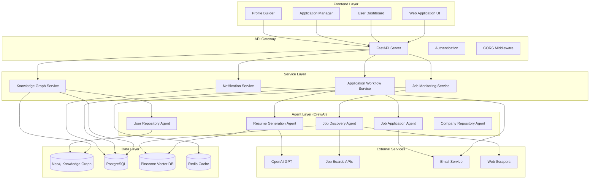
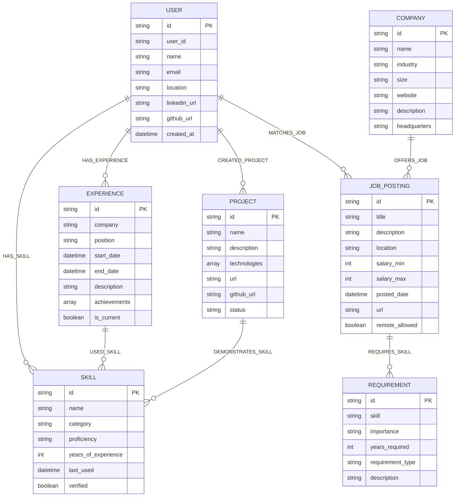
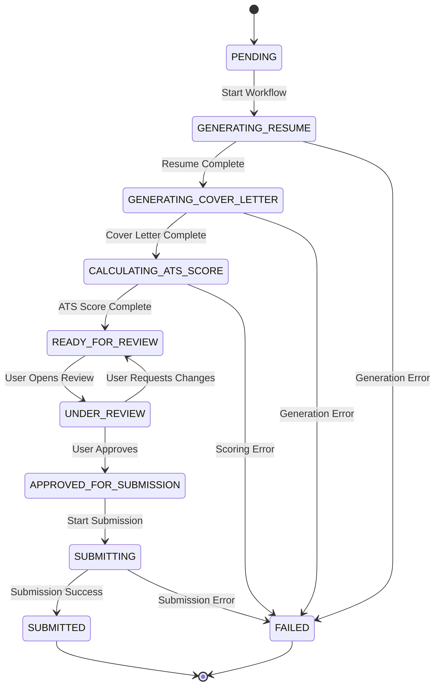
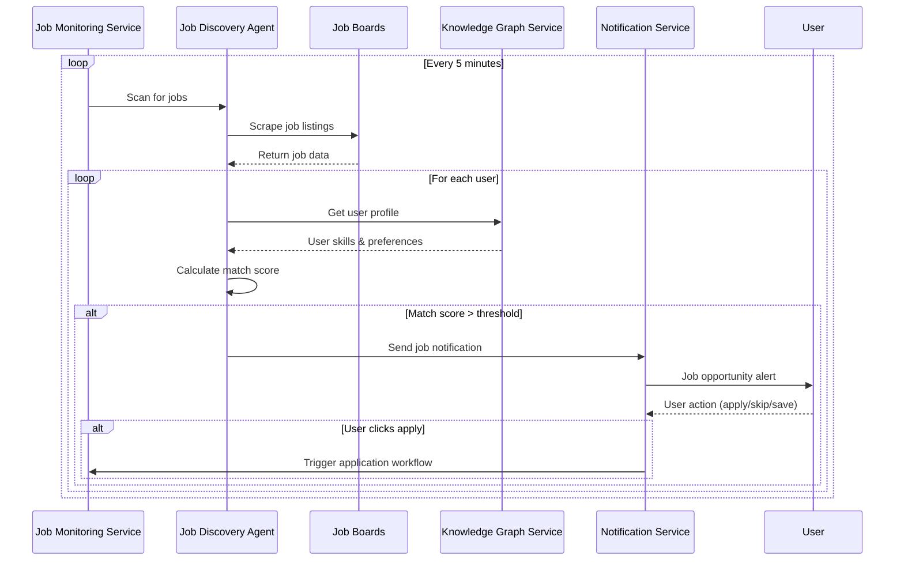
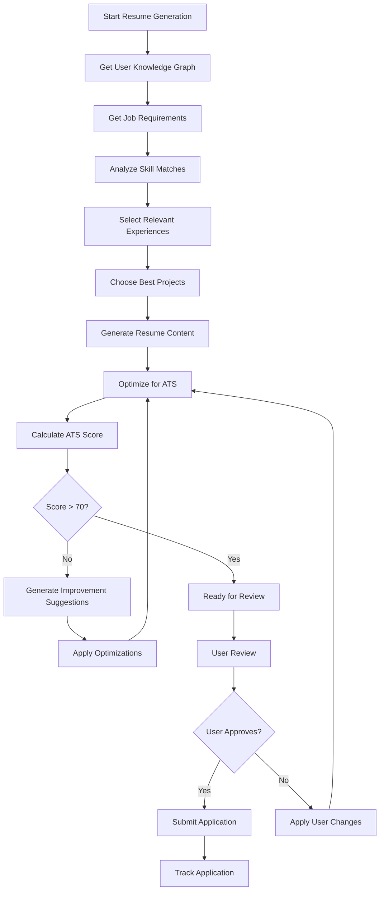
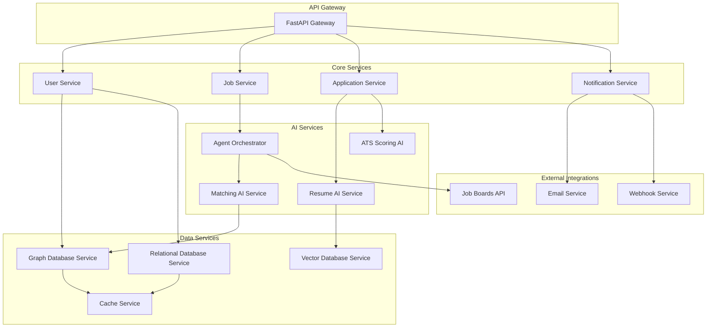
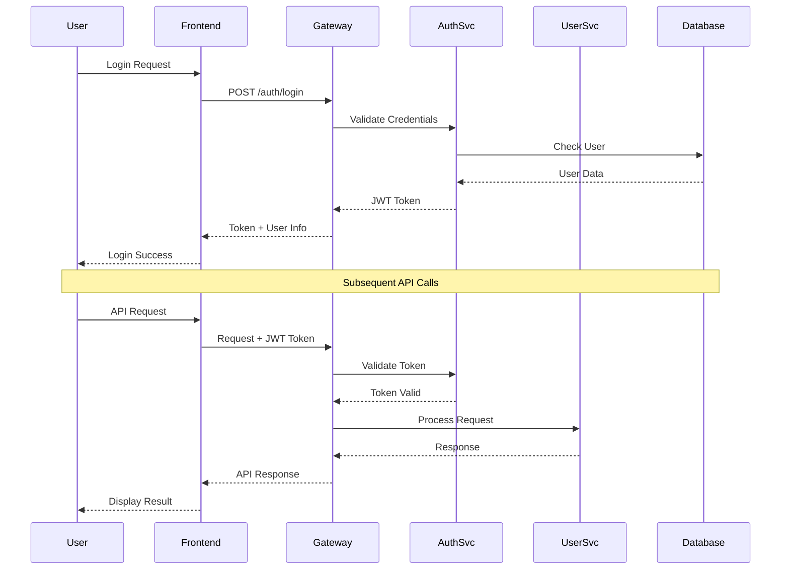
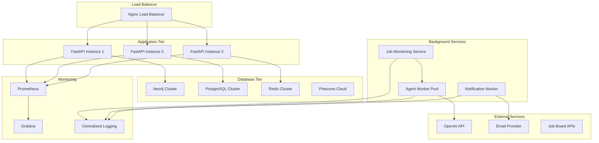
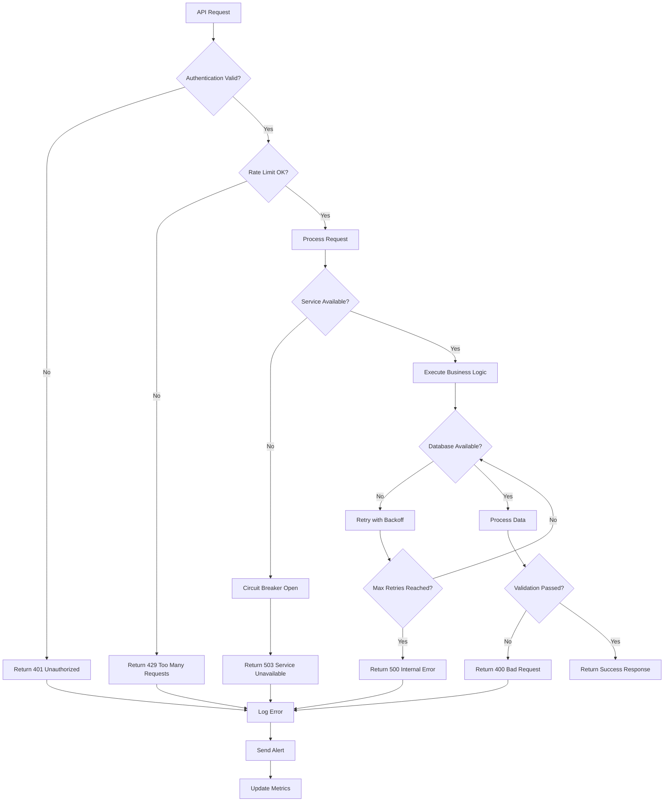

# AI Job Application Assistant - System Diagrams

## System Architecture Overview

## Knowledge Graph Schema

## Application Workflow State Machine

## Job Discovery Flow

## Resume Generation Process

## Data Flow Architecture

```mermaid
graph LR
    subgraph "Input Sources"
        LinkedIn[LinkedIn Profile]
        GitHub[GitHub Profile]
        Resume[Resume Upload]
        Portfolio[Portfolio Documents]
    end

    subgraph "Processing Pipeline"
        URA[User Repository Agent]
        NLP[NLP Processing]
        Extraction[Data Extraction]
        Validation[Data Validation]
    end

    subgraph "Knowledge Graph"
        UserNode[User Node]
        SkillNodes[Skill Nodes]
        ExpNodes[Experience Nodes]
        ProjNodes[Project Nodes]
    end

    subgraph "Job Matching"
        JobScraping[Job Scraping]
        MatchCalc[Match Calculation]
        Scoring[ATS Scoring]
        Ranking[Job Ranking]
    end

    subgraph "Application Generation"
        ResumeGen[Resume Generation]
        CoverGen[Cover Letter Generation]
        Optimization[ATS Optimization]
        Review[User Review]
    end

    subgraph "Output"
        Applications[Job Applications]
        Tracking[Application Tracking]
        Analytics[Success Analytics]
    end

    LinkedIn --> URA
    GitHub --> URA
    Resume --> URA
    Portfolio --> URA

    URA --> NLP
    NLP --> Extraction
    Extraction --> Validation
    Validation --> UserNode

    UserNode --> SkillNodes
    UserNode --> ExpNodes
    UserNode --> ProjNodes

    SkillNodes --> MatchCalc
    ExpNodes --> MatchCalc
    JobScraping --> MatchCalc
    MatchCalc --> Scoring
    Scoring --> Ranking

    Ranking --> ResumeGen
    UserNode --> ResumeGen
    ResumeGen --> CoverGen
    CoverGen --> Optimization
    Optimization --> Review

    Review --> Applications
    Applications --> Tracking
    Tracking --> Analytics
```

## Microservices Communication

## Security & Authentication Flow

## Deployment Architecture

## Error Handling & Recovery

These diagrams provide a comprehensive visual representation of the AI Job Application Assistant system, showing how all components interact and work together to deliver an intelligent job application automation platform.